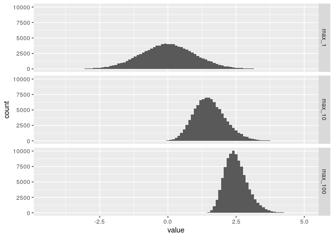
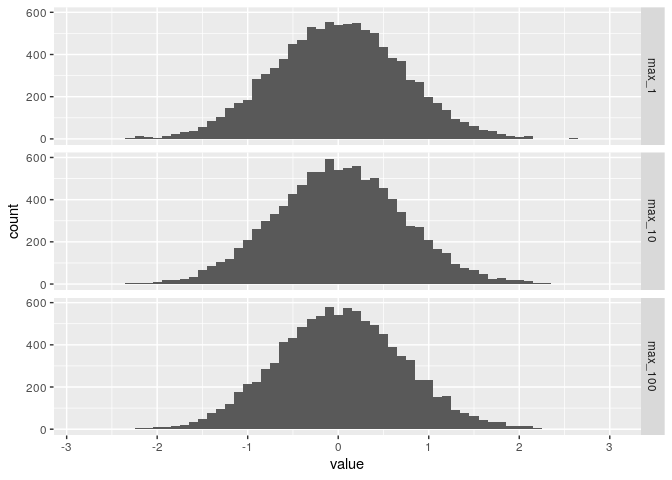

Dawid selection paradox
================

``` r
colMax <- function(X) apply(X, 1, max)
colIdxMax <- function(X) apply(X, 1, function (r) which.max(r))
colSd <- function(X) apply(X, 1, sd)
```

## Selecting the maximum, will not necessarily identify the population value

Here we generate standard normal variables and look at the sample
distribution for a single variable, max of 10 and max of 100. This
selection introduces a bias. Each of our 100 variables actually have
zero mean, and an estimate of the population mean by first selecting is
biased. ie We should estimate a population mean of zero.

This bias depends on many things 1. signal: noise ratio if
\(\mu_i \gg \sigma\) then there will be little effect 2. if we take max
of more variables we have a larger effect

This is a well known no-no in Machine learning. eg You don’t take the
model which has the lowest error on your training data, you use
crossvalidation. \[why not multiple selection on test data then?\]

However, it is still commonly performed. eg ‘feature selection’ based on
high correlation, low p-values etc.

``` r
n_channels <- 100
n_samples <- 100000
samples <- matrix(rnorm(n_samples*n_channels), ncol = n_channels)
mean_10 <- colMeans(samples[,1:10])
mean_100 <- colMeans(samples[,1:100])
sd_10 <- colSd(samples[,1:10])
sd_100 <- colSd(samples[,1:100])

max_10 <- colMax(samples[,1:10])
max_100 <- colMax(samples[,1:100])
df <- data.frame(max_1=samples[,1], max_10=max_10, max_100=max_100)
dfg <- df %>% gather(max_1, max_10, max_100, key="max", value="value")
ggplot(data=dfg) + geom_histogram(aes(x=value),binwidth=.1) + facet_grid( max ~ .)
```

<!-- -->

### Frequentist Viewpoint vs Bayesian

Note that the above in Bayesian terms has prior \(\delta(x)\), ie we
assume prior has mean 0 and variance 0. Perhaps a Bayesian would argue
this is an unrealistic situation to focus on: we should instead look at
what happens with a range of mu. We replicate with a non zero variance
for the true distribution parameters, and calculate the error/bias
between sample mean (after finding maximum) and actual generating value
(\(\mu_i\))

``` stan
data{
  int<lower=0> N_vars;
  int<lower=0> N_replicates;
  real mu;
  real <lower=0> tau;
  real <lower=0> sigma;
}

generated quantities {
  vector[N_vars] mu_i;
  matrix [N_replicates, N_vars] x;
  for (n in 1:N_vars)
    mu_i[n] = normal_rng(mu, tau);
  
  for (n in 1:N_vars)
    for (m in 1:N_replicates)
      x[m, n] = normal_rng(mu_i[n], sigma);
}
```

see [making predictions from stan
models](https://medium.com/@alex.pavlakis/making-predictions-from-stan-models-in-r-3e349dfac1ed)

``` r
N_vars=100
N_replicates=25
mu=0
tau=1
sigma=5
N_iter <- 10000

sim <- sampling(simulation, algorithm = "Fixed_param",   data=list(N_vars=N_vars,  N_replicates=N_replicates, mu=mu, tau=tau, sigma=sigma),
            chains=1, warmup=0, iter=N_iter)
```

    ## 
    ## SAMPLING FOR MODEL 'edc2c4b53c2c5ad135bc10c7c0c16ca5' NOW (CHAIN 1).
    ## Chain 1: Iteration:    1 / 10000 [  0%]  (Sampling)
    ## Chain 1: Iteration: 1000 / 10000 [ 10%]  (Sampling)
    ## Chain 1: Iteration: 2000 / 10000 [ 20%]  (Sampling)
    ## Chain 1: Iteration: 3000 / 10000 [ 30%]  (Sampling)
    ## Chain 1: Iteration: 4000 / 10000 [ 40%]  (Sampling)
    ## Chain 1: Iteration: 5000 / 10000 [ 50%]  (Sampling)
    ## Chain 1: Iteration: 6000 / 10000 [ 60%]  (Sampling)
    ## Chain 1: Iteration: 7000 / 10000 [ 70%]  (Sampling)
    ## Chain 1: Iteration: 8000 / 10000 [ 80%]  (Sampling)
    ## Chain 1: Iteration: 9000 / 10000 [ 90%]  (Sampling)
    ## Chain 1: Iteration: 10000 / 10000 [100%]  (Sampling)
    ## Chain 1: 
    ## Chain 1:  Elapsed Time: 0 seconds (Warm-up)
    ## Chain 1:                3.23457 seconds (Sampling)
    ## Chain 1:                3.23457 seconds (Total)
    ## Chain 1:

``` r
z <- e2 <- rstan::extract(sim)
str(z)
```

    ## List of 3
    ##  $ mu_i: num [1:10000, 1:100] 0.6029 1.0279 0.6887 -1.2224 -0.0703 ...
    ##   ..- attr(*, "dimnames")=List of 2
    ##   .. ..$ iterations: NULL
    ##   .. ..$           : NULL
    ##  $ x   : num [1:10000, 1:25, 1:100] 8.24 -8.68 5.52 -8.94 4.04 ...
    ##   ..- attr(*, "dimnames")=List of 3
    ##   .. ..$ iterations: NULL
    ##   .. ..$           : NULL
    ##   .. ..$           : NULL
    ##  $ lp__: num [1:10000(1d)] 0 0 0 0 0 0 0 0 0 0 ...
    ##   ..- attr(*, "dimnames")=List of 1
    ##   .. ..$ iterations: NULL

``` r
# z$x : n_iter x N_replicates x N_vars
```

standard error of mean is sigma^2/N\_replicates = 1

``` r
mean_i <- matrix(NA, nrow = dim(z$x)[1],
                  ncol = dim(z$x)[3])
sd_i <- matrix(NA, nrow = dim(z$x)[1],
                  ncol = dim(z$x)[3])
for(i in 1:dim(z$x)[1]) {
  for(j in 1:dim(z$x)[3]) {
    mean_i[i, j] <- mean(z$x[i, , j])
    sd_i[i, j] <- sd(z$x[i, , j])
  }
}
# calculate index of mean
max_1 <- mean_i[,1] - z$mu_i[, 1]
idxmax_10 <- matrix(c(seq(N_iter),colIdxMax(mean_i[, 1:10])), ncol=2, byrow=F)
idxmax_100 <- matrix(c(seq(N_iter),colIdxMax(mean_i[, 1:100])), ncol=2, byrow=F)

max_10 <- mean_i[idxmax_10] - z$mu_i[idxmax_10]
max_100 <- mean_i[idxmax_100] - z$mu_i[idxmax_100]


df <- data.frame(max_1, max_10, max_100)
dfg <- df %>% gather(max_1, max_10, max_100, key="max", value="value")
ggplot(data=dfg) + geom_histogram(aes(x=value),binwidth=tau/100) + facet_grid( max ~ .) + ggtitle("bias from true mu_i")
```

<!-- -->

``` r
i_sample <- 1
x_data <- z$x[i_sample, ,]
```

``` stan
data {
  real mu;
  real tau;
  int<lower=0> N_replicates;
  int<lower=0> N_vars;
  matrix[N_replicates, N_vars] x;
}
parameters {
  row_vector[N_vars] mu_i;
  real<lower=0> sigma;
}
model {
  mu_i ~ normal(mu, tau);
  for (j_replicates in 1:N_replicates){
    x[j_replicates] ~ normal(mu_i, sigma);
  }
  
}
```

## MAP estimate for estimating mu at max sample mean

``` r
max_1 <- numeric(N_iter)
max_10 <- numeric(N_iter)
max_100 <- numeric(N_iter)
for (i_iter in 1:N_iter){
  fit <- optimizing(inference, data = list(N_vars=N_vars, N_replicates=N_replicates, mu=mu, tau=tau,      sigma=sigma, x=z$x[i_iter, ,]))
  mu_est <- fit$par[1:N_vars]
  sigma_est <- fit$par[N_vars + 1]
  
  idxmax_10 <- which.max(mu_est[1:10])
  idxmax_100 <- which.max(mu_est[1:100])

  max_1[i_iter] <- mu_est[1] - z$mu_i[i_iter, 1]
  max_10[i_iter] <- mu_est[idxmax_10] - z$mu_i[i_iter, idxmax_10]
  max_100[i_iter] <- mu_est[idxmax_100] - z$mu_i[i_iter, idxmax_100]
  if (i_iter <10) {
    cat(max_1[i_iter], max_10[i_iter], max_100[i_iter])
  }
  
}
```

    ## -0.4263172 0.2386711 -1.535792-0.6610115 -0.6610115 0.4564690.09853964 0.7660549 0.78159080.4667417 -0.5783346 -0.043151150.4345195 -0.04891816 0.81728040.09462651 0.8175244 0.3678575-0.1693071 -0.1693071 -1.5652-1.916232 -0.8060904 0.4422296-0.782908 -0.03068857 -0.1083094

``` r
df <- data.frame(max_1=max_1, max_10=max_10, max_100=max_100)
dfg <- df %>% gather(max_1, max_10, max_100, key="max", value="value")
ggplot(data=dfg) + geom_histogram(aes(x=value),binwidth=.1) + facet_grid( max ~ .)
```

<!-- -->

## Dawid

In [selection paradoxes of Bayesian
inference](https://projecteuclid.org/download/pdf_1/euclid.lnms/1215463797)
Dawid points out that no adjustment seems required in a Bayesian
framework.

The posterior is already conditioned on the data, no adjustment is
needed for the selection process.

We consider the following idealised set up. We test \(p\) varieties
\(X_i \sim N(\mu_i,\sigma^2)\)

We set \(i^*\) to be the index with highest sample mean \((X_i)\), and
we are interested in estimation \(\mu_{i^*}\), the population mean of
the index with the highest sample mean.

2.2 Optimized parameter

we first consider estimating \(\mu^{**} := \sup \mu_i\). \(X_i\) is
unbiased for \(\mu_i\).  
The naive estimator \(X^* = \sup X_i\), \(X^* \ge X_i\) ,so
\(E_X(X^*) \ge \sup_i E_X(X_i) = \mu^{**}\), so \(X^*\) is positively
biased for \(\mu^{**}\).

with equality only if \(I^*=i^{**}\) with probability 1 ??

2.3 *Data-dependent parameter*. Suppose again that \(X_i\) is unbiased
for \(\mu_i\), all i. We now proceed with a two-stage approach. At the
first stage we use the full data X to determine the realized value
\(i^*\), of \(I^*\), which achieves \(\sup{X_i}\), and is thus likely to
be associated with a large parameter \(\mu_i\); and at the second stage,
having thus determined that the parameter of interest is
\(\mu^* = \mu_{i^*}\), we proceed to make inferences about it

We use the face value estimator \(X_{i^*}\) to estimate
\(\mu^*=\mu_I^*\).

\(\mu^* \le \mu^{**} \le E_X(X^*)\) and typically strict with prob 1.

3 Bayesian Inference. Let \(\mu\) have a prior distribution, and let
\(Y_i\) be posterior expectation \(E(\mu_i|X)\). Let
\(Y^{**}=E(\mu^{**}|X)\) and \(Y^{*}=E(\mu^{*}|X)\). Let
\(Y^{\dagger}=\sup Y_i\) be achieved at \(I^\dagger\) and define
\(\mu^\dagger\) to be corresponding data-dependent parameter
\(\mu_I^\dagger\)

\(Y^{**} \ge Y^\dagger \ge Y^*\). The frequentist analysis above would
lead to expect that \(Y^{**}\) and .. should be smaller than \(X^*\) to
counter the effect of bias.

3.1 Improper priors We take improper prior for \(\mu\), so then \(Y_i\)
is unbiased for all \(i\), then \(Y_i = X_i\) and sim
\(I^\dagger, Y^\dagger, \phi^\dagger\) correspond to
\(I^*\dagger*, Y^*, \phi^*\). But then Bayesian estimate
\(E(\mu^*|X) = Y^* = X^{I^*} = X^*\) incorporates no correction for
selection bias. Infact since \(Y^{**} > Y^*\), the Bayesian estimate of
\(\phi^{**}\) adjusts \(X^*\) in a positive direction\!

3.2 Proper prior

With a proper prior we have $0 = Y^\* - E(^*|X) = E( Y^* - ^\*|X) $, so
\(E_X(Y^*) \le \mu^*\) for some \(\mu\)

….

Although free of logical inconsistencies, still seems unsatisfactory

EG 5 Take proper prior \(\mu_i \sim N(0, \tau^2)\) independently

In posterior, $\_i N(y\_i, ( + )^{-1}), with
\(y_i=\frac{\tau^2}{\tau^2 + \sigma^2}x_i\). . Suimilarly, for
\(\mu^*\).

So large values of \(\x^*\) are shifted downwards. But effect depends
only on size of \(x^*\) and not on selection process (eg number of
treatments). In particular no shrinkage if prior variance is large
compared to data-precision \(\sigma\)
